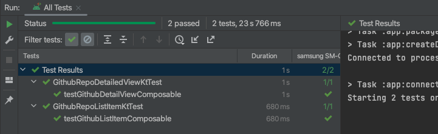

# NYTimes-MVVM-Compose-Retrofit-Dagger-Coil-Kotlin_DSL_withTests

# This is a MVVM Android App developed using some of latest Android libraries as of 2023/24

1. Model-View-ViewModel architecture
2. Dagger for Dependency Injection
3. Retrofit for Service with Gson
4. Kotlin for development
5. Kotlin DSL for converting gradle scripts from Groovy to Kotlin
6. Coroutines for viewModel handling of async and non-blocking programming.
7. Jetpack Compose for Card Item and LazyColum which is recyclerView in Compose World.
8. Coil Image API for image loading/caching
9. Mockito/Espresso/extJunit/Robolectric for unit testing and android tests for viewmodel, views
10. OKHttp Interceptor/Mockserver for logging service responses on Logcat and creating mock server
    for testing Repository

Here's the video of how the app works and looks like.

I used the Android TopBar Search for finding the repository with help of
its state flows and after retrieving the data, show to UI using Composable
View Components one for Item List card view which is used in Lazy Column Search List and another for
Detailed View.

